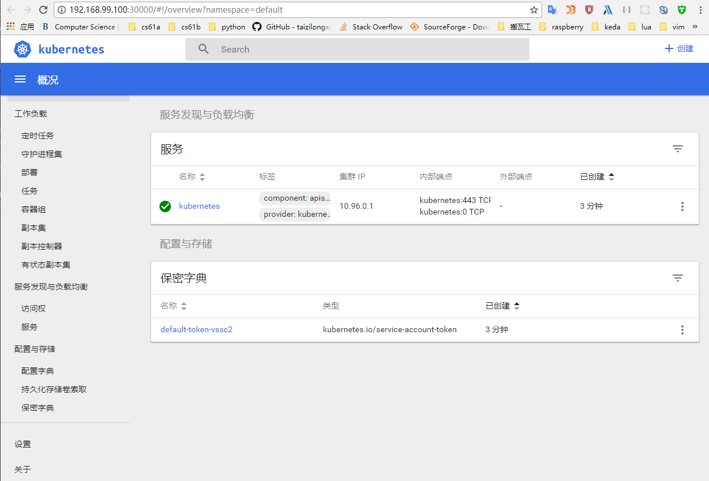
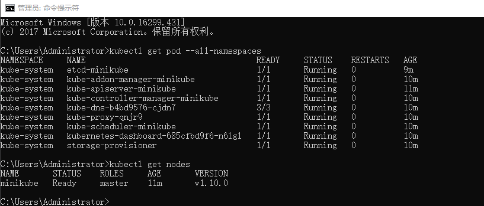

# [nimikube 安装不翻墙](https://yq.aliyun.com/articles/221687)

## 安装kubectl[官方教程](https://kubernetes.io/docs/tasks/tools/install-kubectl/)
### 方案一 Install with Powershell from PSGallery
[powershell无法执行ps文件](https://www.cnblogs.com/urwlcm/p/4333119.html)未成功
(执行失败)
You can now start kubectl from C:\Users\ybife\AppData\Local\Temp\kubectl.exe
copy your remote kubernetes cluster information to C:\Users\ybife\.kube/config
### 方案二 Install with Chocolatey on Windows
*安装choco 
1 Run Get-ExecutionPolicy. If it returns Restricted, then run Set-ExecutionPolicy AllSigned or Set-ExecutionPolicy Bypass -Scope Process.
Now run the following command:
```
Set-ExecutionPolicy Bypass -Scope Process -Force; iex ((New-Object System.Net.WebClient).DownloadString('https://chocolatey.org/install.ps1'))
```
2 重新打开powershell 确认choco是否安装成功
* 安装kubectl
```
choco install kubernetes-cli
kubectl version
```

## 安装 minikube
### 安装阿里的[minikube-windows-amd64.exe](http://kubernetes.oss-cn-hangzhou.aliyuncs.com/minikube/releases/v0.28.0/minikube-windows-amd64.exe?spm=a2c4e.11153940.blogcont221687.28.7dd57733DopMOu&file=minikube-windows-amd64.exe),重命名为minikube.exe,添加到Path；
### 启动
```
minikube start --registry-mirror=https://registry.docker-cn.com  # 执行前关闭翻墙操作
```
* 若启动出错则删除后重新执行start
```
minikube delete
minikube cache delete
```
### 浏览器进入面板
```
minikube dashboard #浏览器打开面板
minikube dashboard --url  #查看面板http地址
```
* dashboard

* pod   nodes
