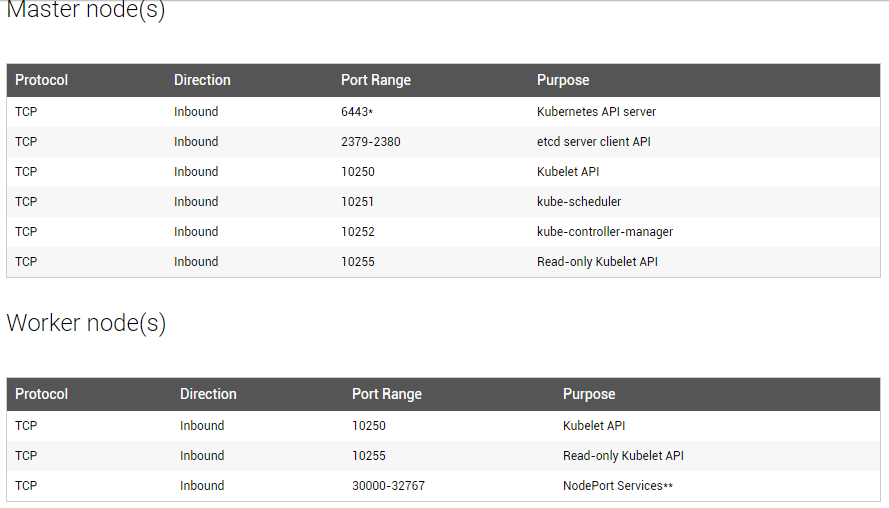

# [安装kubeadm](https://kubernetes.io/docs/tasks/tools/install-kubeadm/)
## 条件
* 系统支持：
    * Ubuntu 16.04+
    * Debian 9
    * CentOS 7
    * RHEL 7
    * Fedora 25/26 (best-effort)
    * HypriotOS v1.0.1+
    * Container Linux (tested with 1576.4.0)
* 最少2GB RAM，不让应该用程序可使用空间会很小
* 最少 2 CPUs
* 集群内所有设备网络连接正常
* 每个节点标识唯一（hostname,MAC,product_uuid）
    ```
    ip link or ifconfig -a
    sudo cat /sys/class/dmi/id/product_uuid
    ```
* 开启特定端口 

* 关闭swap
```
#重启后失效
$ swapoff -a 
```
## 安装Docker
推荐版本17.03
稳定版本1.11、1.12、1.13
17.06+不确定肯定行可能不行（待验证）
* 直接安装
```
apt-get update
apt-get install -y docker.io
```
* 安装17.03
```
apt-get update
apt-get install -y apt-transport-https ca-certificates curl software-properties-common
curl -fsSL https://download.docker.com/linux/ubuntu/gpg | apt-key add -
add-apt-repository "deb https://download.docker.com/linux/$(. /etc/os-release; echo "$ID") $(lsb_release -cs) stable"
apt-get update && apt-get install -y docker-ce=$(apt-cache madison docker-ce | grep 17.03 | head -1 | awk '{print $3}')
```
## 安装 kubeadm,kubelet,kubectl
kubeadm:引导集群
kubelet：操作pods（节点组）和容器（containers）
kubectl:操作集群
```
apt-get update && apt-get install -y apt-transport-https curl
curl -s https://packages.cloud.google.com/apt/doc/apt-key.gpg | apt-key add -
cat <<EOF >/etc/apt/sources.list.d/kubernetes.list
deb http://apt.kubernetes.io/ kubernetes-xenial main
EOF
apt-get update
apt-get install -y kubelet kubeadm kubectl
```
国内源和秘钥
```
$ curl -s https://raw.githubusercontent.com/EagleChen/kubernetes_init/master/kube_apt_key.gpg | apt-key add -
#源
deb https://mirrors.aliyun.com/kubernetes/apt kubernetes-xenial main
```
## 确认master上kubelet的 cgroup驱动和Docker是否匹配
```
$ docker info | grep -i cgroup
$ cat /etc/systemd/system/kubelet.service.d/10-kubeadm.conf
```
*如果不匹配（不太明确作用）
```
$  --cgroup-driver 
$ sed -i "s/cgroup-driver=systemd/cgroup-driver=cgroupfs/g" /etc/systemd/system/kubelet.service.d/10-kubeadm.conf
```
* 重启kubelet
```
$ systemctl daemon-reload
$ systemctl restart kubelet
```
