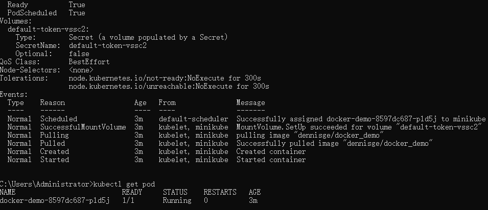

# 部署应用[参照](https://github.com/gedennis/node-tribe-blog/issues/5)


## 部署容器
### 方式一 kubectl run
```
$ kubectl run docker-demo --image=docker_demo --port=1226
```
linux 卡在event第三行(拉去镜像问题,重新run成功)

### 方式二 kubectl create [*.yaml](../deployment.yaml). [[详情](./yaml_config.md)]
```
$ kubectl create -f deploymentorpod.yaml
# 查看状态
$ kubectl get pod
# 若状态不是running则查看详细信息
$ kubectl describe deploymet deploymentname
```
### 查看deploy运行状态及节点
```
$ kubectl get pod -o wide
NAME                                READY     STATUS    RESTARTS   AGE       IP           NODE
docker-demo-yaml-7bd847cd46-9cmkg   1/1       Running   0          2m        10.244.1.3   yangbf-virtualbox
docker-demo-yaml-7bd847cd46-djsp4   1/1       Running   0          2m        10.244.1.2   yangbf-virtualbox

```
### 发布服务
```
$ kubectl expose deployment/<deployment name> --type=NodePort --port=1226
```
### 获取服务url
* minikube
```
# 自动打开默认浏览器访问
$ minikube service <deployment name>
# 获取服务url
$ minikube service <deployment name> --url
```

* kubeadm
```
$ kubectl get svc service_name
NAME               TYPE       CLUSTER-IP     EXTERNAL-IP   PORT(S)          AGE
docker-demo-yaml   NodePort   10.97.26.103   <none>        1226:30564/TCP   50m
# 30564为web访问端口
# 访问ip为服务所在node主机的ip
```

